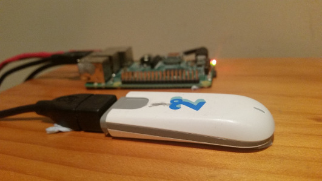

# SMS Gateway (Huawei E303)



For more information visit https://etherarp.net/building-a-sms-gateway-from-a-huawei-usb-modem/

## Scripts
- Connect/Disconnect modem `hilink_connect, hilink_disconnect`
- Query device information `hilink_device_information`
- Query notifications `hilink_notifications`
- Query device status `hilink_status`
- Query traffic statistics `hilink_traffic_stats`
- Query SMS Inbox `hilink_sms_list`
- Send SMS message `hilink_sms_send $message $number`
- Get/Send USSD `hilink_ussd_get $ussd` `hilink_ussd_send $ussd`

## What is this?
An SMS-Gateway is a server that provides an API for sending and/or receiving SMS/Text messages.
The E303 (and other Hauwei modems) provide a web GUI interface and an XML API for programmatic access.

This contains a set of scripts to manage Hauwei modems, including sending/receiving SMS. It has been tested on the Hauwei E303 and E3372.


## IP Addresses 

Hilink E303  - http://192.168.1.1
Hilink E3372 - http://192.168.8.1


## Switching to CDC_Ether mode

For API Access, the device needs to run in cdc_ether modem (which is the usual default) 
Occasionally, it will boot into a different mode and a modeswitch command will be required 

```
# Change to cdc_ether mode
usb_modeswitch -v 12d1 -p 1f01 -M '55534243123456780000000000000011062000000101000100000000000000'
```

## What if 192.168.1.0/24 clashes with my LAN
This workaround is for Linux only.

    # Create a network namespace for the HiLink 
    sudo ip netns add sms
    # Add the hilink to the network namespace and bring it online
    sudo ip link dev enp0s29u1u6
    sudo ip netns exec sms ifconfig enp0s29u1u6 up 192.168.1.100/24

    # Run the hilink commands inside the network namespace 
    sudo ip netns exec sms ./hilink_status

